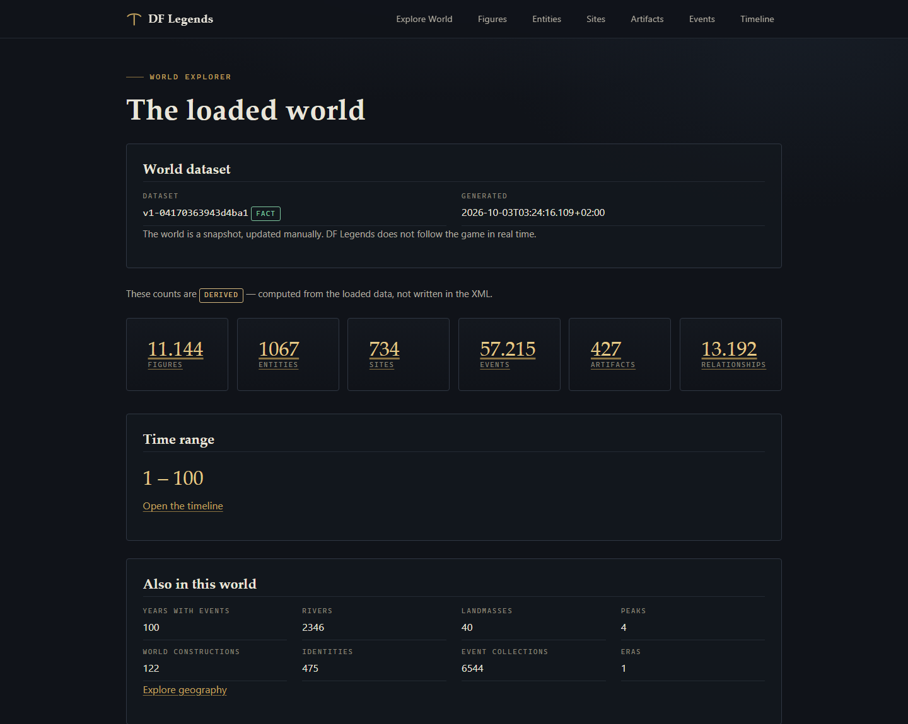

# DF Legends · Informe del ciclo de refresco

Todo lo que sigue procede de **ejecución real** en este repositorio. Las
mediciones se tomaron con `python`, `curl` y Chrome; ninguna cifra está
estimada.

---

## 1. El modelo de actualización

```
Dwarf Fortress
      ↓  Guardar / exportar          ← el jugador lo decide
00_SOURCE/original_data/legends.xml + legends_plus.xml
      ↓  Extracción MANUAL           ← una vez, no en cada tick
00_SOURCE/work/staging-<sello>/      ← árbol COMPLETO aparte
      ↓  Validación (estructura + núcleo + manifiesto)
00_SOURCE/backups/merged-<sello>/    ← se aparta la versión anterior
      ↓  Activación (rename, con reversión automática)
00_SOURCE/processed/merged/*.jsonl   ← dataset activo
      ↓  dataset_version.json        ← se escribe AL FINAL
      ↓  python run.py               ← la API carga el mundo nuevo
API  →  DF Legends
```

Las ocho etapas son las que ya implementaba `actualizar_datos.py`. Esta
misión **no las reescribe**: añade poder saber en cuál se está.

### La unidad de información es el SNAPSHOT, no el tick

| | |
|---|---|
| Qué se actualiza | El mundo entero, de golpe |
| Cuándo | Cuando alguien exporta y ejecuta `--actualizar` |
| Cada cuánto | A mano. Tarda **12 s** de media en el dataset real |
| Durante la partida | **Nada.** El juego no se toca |

Una partida genera cambios masivos; seguirla tick a tick daría datos que
cambian mientras se leen. Un snapshot es un estado cerrado y coherente.

### Qué NO ocurre, por diseño

| No | Por qué |
|---|---|
| Actualización por tick | Inútil: el mundo cambia constantemente |
| Vigilancia continua del XML | La API solo mira el disco cuando se le pregunta |
| Recarga en caliente | Riesgo de servir una mezcla sin necesidad |
| Extracción automática | Exportar es decisión del jugador |
| IA / LLM / RAG / embeddings | Fuera de alcance (§16) |
| Backend remoto | Fuera de alcance (§18) |

## 2. Cómo actualizar (comandos reales)

```bash
python run.py --actualizar        # generar, validar y activar
python run.py --estado            # ver el dataset activo
python run.py                     # arrancar la API (o reiniciarla)
```

`--actualizar` termina diciendo exactamente qué hacer:

```
ACTUALIZACION CORRECTA
   OK  la nueva version esta activa
   OK  dataset activo: v1-04170363943d4ba1
      respaldo de la anterior: ...\00_SOURCE\backups\merged-20261003-032416

SIGUIENTE PASO
      Si la API esta ABAJO, terminada y vuelve a arrancar:  python run.py
      Si la API esta EN MARCHA, sigue sirviendo el dataset ANTERIOR:
        cierrala (Ctrl+C) y arranca de nuevo:  python run.py
      La web avisara del cambio al recargar. No hace falta nada mas.
```

### Si algo falla

```
ACTUALIZACION CANCELADA
      La version activa NO se ha modificado.
```

`ErrorActualizacion` significa siempre lo mismo: **el dataset activo no se
tocó**. La versión anterior sigue en su sitio y su copia queda en
`00_SOURCE/backups/`.

## 3. La decisión: reiniciar, no recargar en caliente

La auditoría (`refresh_cycle_initial_audit.md`) midió que la API cachea su
dataset para siempre y **no detecta los cambios en disco**. Se compararon las
dos opciones:

| Criterio | Reiniciar | Recarga en caliente |
|---|---|---|
| Complejidad | ninguna, ya funciona | media: bloqueo, rollback, concurrencia |
| API a medias | imposible por construcción | hay ventana vulnerable |
| Mezcla de datos | **imposible**: procesos distintos | posible sin bloqueo |
| Fallo de carga | el proceso viejo sigue sirviendo | hay que reconstruirlo |
| Aporta valor | — | poco: el ciclo ya es manual |

**Se eligió reiniciar.** Dos procesos distintos no comparten memoria, así que
la mezcla de datasets es imposible por construcción y no por suerte.

Lo que sí faltaba —y era real— es **poder saber qué dataset se sirve**. Eso
queda resuelto con un identificador.

## 4. El identificador del dataset

```
dataset_id = "v1-" + sha256( JSON ordenado de {fichero: sha256} )  [:16]
```

Se **deriva del contenido real** de los JSONL, no de un reloj ni de un
contador:

| Propiedad | Por qué | Comprobada en |
|---|---|---|
| Determinista | Dos actualizaciones iguales no parecen "mundos nuevos" | `test_mismo_contenido_mismo_id` |
| Sensible a un byte | Cambia si cambia el dataset | `test_un_byte_cambia_el_id` |
| Sin invenciones | Sale de SHA-256 medidos | `test_servicio_y_actualizador_coinciden` |
| Degrada bien | Sin registro, se declara `UNKNOWN` con motivo | `test_dataset_vacio_declara_unknown` |

Verificado en ejecución real: se ejecutó `--actualizar` completo sobre el
dataset real y el id salió **`v1-04170363943d4ba1`**, el mismo que el que
devuelve la lectura derivada de las huellas. El contenido no había cambiado, y
el id tampoco: eso es exactamente lo que se pidió.

## 5. Cómo comprobar la versión

Tres caminos, todos verificados:

```bash
python run.py --estado          # por terminal
curl http://127.0.0.1:877/api/salud
```

```json
{
  "data": {
    "estado": "ok",
    "dataset": {
      "dataset_id": "v1-04170363943d4ba1",
      "dataset_generado": "2026-10-03T03:24:16.109+02:00",
      "conteos": {"figuras": 11144, "entidades": 1067, "sitios": 734,
                  "eventos": 57215, "artefactos": 427, "anios": [1, 100]},
      "certainty": "FACT"
    }
  }
}
```

**Los campos antiguos no se tocan.** `estado`, `eventos`, `figuras`,
`ruta_datos`, `export_root` y `limite_maximo` conservan nombre y valor;
`dataset` es puramente aditivo. Lo comprueba
`test_contrato_antiguo_intacto`.

## 6. La Web

### El indicador

En el dashboard, un panel discreto con el mismo lenguaje visual (piedra,
latón) que el resto. Captura real:



Si no se puede saber, **lo dice**: muestra "Dataset identity is unavailable" y
el motivo. Nunca inventa un identificador ni una fecha.

### El aviso de cambio

```
┌────────────────────────────────────────────────────────────┐
│ A new world snapshot is available.                         │
│ The dataset changed from v1-04170363943d4ba1 to            │
│ v1-0000000000000001.                                        │
│ Reload to explore the updated world, or keep reading...    │
└────────────────────────────────────────────────────────────┘
```

Tres decisiones deliberadas:

| Decisión | Motivo |
|---|---|
| **Avisa, no recarga** | Un `location.reload()` perdería el scroll, la búsqueda y la ficha abierta |
| **Sin polling** | Se comprueba al cargar y al volver a la pestaña. Un dataset cambia una vez cada actualización manual: un `setInterval` solo gastaría recursos |
| **Enlace real** | Recargar es un clic del usuario, no un efecto secundario |

### Verificado en Chrome real

`pruebas_refresh_web.mjs` → **11/11 comprobaciones**:

| Comprobación | Resultado |
|---|---|
| El panel se muestra | OK |
| El id tiene el formato `v1-<16 hex>` | OK |
| La fecha viene del registro real | OK |
| Sin rutas internas ni tracebacks | OK |
| El dataset cambia en disco → avisa | OK |
| El aviso nombra el anterior y el nuevo | OK |
| **La página NO se recarga sola** | OK |
| El aviso ofrece recargar | OK |
| Al recargar a mano se ve el mundo nuevo | OK |
| Ya no hay aviso tras recargar | OK |
| Solo se habla con la API configurada | OK |

La prueba restaura `dataset_version.json` **siempre**, incluso si falla:
quedó verificado que el registro volvió a `v1-04170363943d4ba1` sin residuos.

## 7. Rendimiento medido

Medido con el dataset real (11.144 figuras, 57.215 eventos, 58 MB de eventos):

| Fase | Tiempo |
|---|---|
| Actualización completa (`--actualizar`) | **12,0 s** |
| Carga del núcleo al arrancar | **2,38 s** |
| `/api/salud` | 0,8 ms (mediana) |
| `/api/stats` | 0,6 ms (mediana) |
| `/api/geografia/punto/112/20` | 0,8 ms (mediana) |
| **Hasta servir el dataset nuevo** | **≈2,4 s + arranque del proceso** |

No se ha optimizado nada: no hacía falta. La carga de 2,4 s ocurre una vez, al
arrancar, y por eso la caché existe. Las respuestas son de sub-milisegundo
porque todo está indexado en memoria.

## 8. Errores y recuperación

| Situación | Qué pasa | Comprobado por |
|---|---|---|
| Dataset corrupto | Falla la carga; A sigue en pie | `test_caso_6_dataset_corrupto_no_destruye_a` |
| JSONL truncado a mitad de registro | Falla; no se cuela | `test_jsonl_truncado_no_se_cuela` |
| Dataset inexistente | El núcleo sirve un índice vacío, **no revienta** (medido) | `test_caso_7_carga_fallida_deja_el_anterior_disponible` |
| Manifiesto inválido | Degrada a `UNKNOWN` con motivo; la API sigue viva | `test_manifest_incorrecto_se_ignora` |
| Fallo de validación | `ACTUALIZACION CANCELADA`; la activa no se tocó | 43 pruebas de actualización |
| Fallo de activación | Reversión automática a la anterior | 43 pruebas de actualización |
| Dos actualizaciones a la vez | Cada carga es atómica; siempre queda un mundo válido | `test_cargas_concurrentes_dejan_un_mundo_valido` |
| Peticiones durante el cambio | Ninguna falla; ninguna mezcla datos | `test_lecturas_paralelas_durante_el_cambio` |

### Un hallazgo que merece atención

El núcleo **no falla si el dataset no existe**: `cargar_jsonl()` devuelve `[]`
y se sirve un índice vacío en lugar de romperse. Quien impide que eso llegue a
producción es `actualizar_datos.validar_estructura()`, que actúa **antes** de
activar. La frontera está documentada en el propio test, para que nadie la
descubra por sorpresa si alguna vez se relajara la validación.

## 9. Coherencia del snapshot

Dos pruebas la vigilan:

- **200 lecturas** de stats y listados con el mundo cambiando: la cuenta de
  figuras y los nombres siempre van juntos. Nunca hay conteos de A con nombres
  de B.
- **Lecturas paralelas** mientras el dataset alterna: ninguna petición falla.

La coherencia no depende de bloqueos porque con la Opción A **cada proceso solo
puede servir un dataset**: el que cargó al arrancar.

## 10. Seguridad

| Comprobación | Resultado |
|---|---|
| `/api/salud?dataset=C:/datos` | Se ignora; no elige dataset |
| `?file=../../x`, `?ruta=..%2F..`, `?path=/tmp` | Se ignoran |
| Respuestas con `Traceback` | Ninguna |
| Rutas internas en la Web | Ninguna (verificado en Chrome) |
| Build público → API local | **Ninguna conexión**; muestra "no API configured" |

No existe ningún endpoint que acepte rutas, y no se ha añadido ninguno: la
misión no implementa recarga, así que no hay nada que proteger.

## 11. Integridad de los datos

| Fichero | Antes | Después |
|---|---|---|
| `legends.xml` | `77DB4739…F11735` | **idéntico** |
| `legends_plus.xml` | `FB6BE93D…94ABC2D` | **idéntico** |
| JSONL de `processed/` | 56 ficheros | **56, los 56 idénticos** |

Se comprobó fichero por fichero contra el manifiesto previo. Ni
`original_data/`, ni `processed/`, ni `processed/validation/`, ni `fixtures/`,
ni `nucleo.py`, ni `integrar_legends.py` se han modificado.

## 12. Un fallo encontrado por el camino

`api.crear_servidor()` usaba:

```python
puerto = int(puerto or config.PUERTO_DEFECTO)   # 0 se convierte en 877
```

El puerto `0` significa "elige uno libre", pero `0 or PUERTO` devuelve el
puerto por defecto. Con la API real ya arrancada en 877, las pruebas se
conectaban **al servidor ajeno** y medían el dataset real en vez del banco de
pruebas: 28 pruebas fallaban por un motivo sin relación con lo que probaban.

Corregido con `is None`:

```python
puerto = config.PUERTO_DEFECTO if puerto is None else int(puerto)
```

No cambia el comportamiento de producción: `run.py` siempre pasa un puerto
explícito, así que el resultado es idéntico. Lo que cambia es que por fin se
puede pedir un puerto efímero, que es lo que necesitan las pruebas.

## 13. Pruebas

| Suite | Antes | Ahora |
|---|---|---|
| Núcleo | 48 | 48 OK |
| Integración | 20 | 20 OK |
| Adversarial | 39 | 39 OK |
| API | 54 | 54 OK |
| Web | 65 | 65 OK |
| Actualización | 43 | 43 OK |
| Geografía | 41 | 41 OK |
| Navegador (Playwright) | 57 | 57 OK |
| **Refresh (nueva)** | — | **28 OK** |
| **Refresh Web (nueva)** | — | **11 OK** |

**Total: 395 comprobaciones en verde.** Ninguna suite se sustituyó.

La nueva `dfchron/pruebas/probar_refresh_cycle.py` cubre los casos 1 a 12 de
la misión: ciclo completo, dataset corrupto que no destruye el anterior, fallo
de carga, coherencia de snapshot, actualizaciones simultáneas, determinismo
del identificador, ausencia de acceso HTTP al sistema de ficheros y
compatibilidad del contrato anterior.

## 14. Fuera de alcance, confirmado

| | |
|---|---|
| IA | No implementada. `AI_PROJECT_CONTEXT.md` y `ai_data_contract.md` intactos |
| `.exe` | No implementado |
| Cloudflare | El build público sigue sin conectar con la API local (verificado sirviéndolo: "no API configured") |
| FACT/DERIVED/UNKNOWN | Sin cambios. `UNKNOWN` sigue siendo `UNKNOWN` |
| Recarga en caliente | No implementada, por decisión argumentada |
| Polling agresivo | No implementado: se comprueba al cargar y al volver a la pestaña |

La arquitectura admite añadir IA después: la capa de refresco no toca la
semántica de certidumbres y sigue distinguiendo el dato de su permiso para
revelarlo.